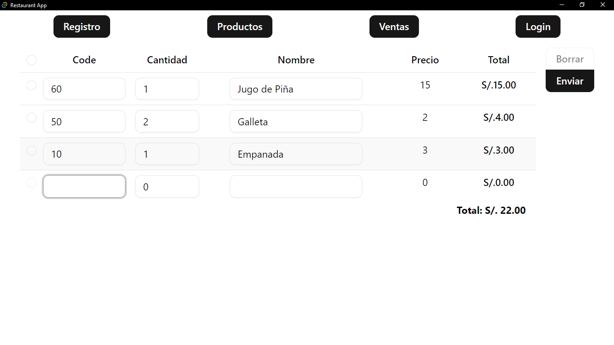
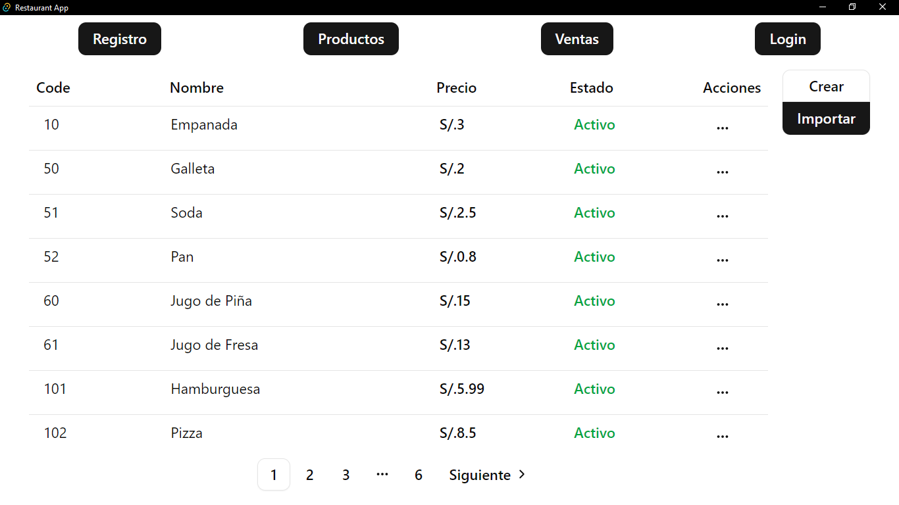
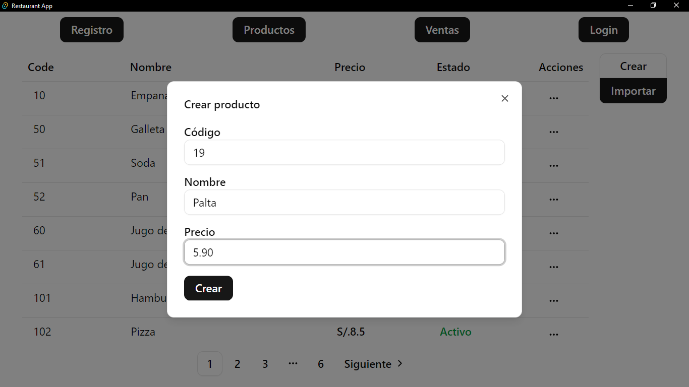
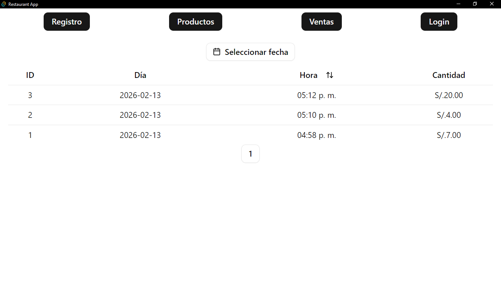

# Restaurant App POS


[English](./README.md)

**Aplicación POS de escritorio** para restaurante: inventario/registro + control de ventas, hecha con **React + Vite** y empaquetada como app con **Tauri** (SQLite).

## Capturas






## Funcionalidades

- Gestión de **registro / inventario**
- CRUD de **productos** + importación/exportación (CSV/XLSX)
- Seguimiento de **ventas** y filtros
- **Base de datos local** con SQLite (Tauri SQL plugin)

## Stack

- **Frontend**
  - React + TypeScript
  - Vite
  - Tailwind CSS
  - shadcn/ui (Radix)
- **Desktop**
  - Tauri (Rust)
  - SQLite vía `tauri-plugin-sql`

## Estructura del proyecto

```text
src/
  app/            App base + router
  components/     Componentes compartidos (Header, ui/*)
  constants/      Configuración de la app (p.ej links a GitHub)
  database/       Helpers / inicialización de DB
  features/       Módulos por dominio (products, registry, sales, users)
  pages/          Páginas por ruta (Products, Registry, Sales, login/*)
  store/          Stores globales (userStore)
src-tauri/        Backend/packaging de Tauri (Rust)
assets/           Capturas
```

## Requisitos

- Bun
- Toolchain de Rust (para builds de Tauri)
- OS soportado por Tauri (Windows/macOS/Linux)

## Inicio rápido (Desktop)

```sh
bun install
bun tauri dev
```

## Scripts

```sh
# web dev
bun dev

# typecheck + web build
bun run build

# desktop dev
bun tauri dev
```

## Base de datos (SQLite)

Esta app usa SQLite a través de Tauri.

Si necesitas agregar el plugin de SQL (en este repo ya está incluido):

```sh
cd ./src-tauri/
cargo add tauri-plugin-sql --features sqlite
```

## Créditos / Código fuente

Dentro de la app, en la pantalla de Login se muestran links a:

- Repo
- Perfil de GitHub

Se configuran en `src/constants/config.ts`.

## Notas de setup (cómo se creó este proyecto)

Esto es una referencia de los pasos/paquetes usados al crear el proyecto.

```sh
bun create vite restaurant-pos
cd ./restaurant-pos

bun add -D esbuild standard -E
bun add -D tailwindcss @tailwindcss/vite -E
bun add -D shadcn-ui -E

bun add @tanstack/react-form -E
bun add react-hook-form zod -E
bun add react-router-dom -E
bun add @tauri-apps/plugin-sql -E
bun add papaparse @types/papaparse -E
```

```sh
bun add -D @types/node

bunx shadcn init
bunx --bun shadcn@latest add form input button checkbox
bunx --bun shadcn@latest add table pagination
bunx --bun shadcn@latest add dialog button-group
bunx --bun shadcn@latest add popover dropdown-menu
bunx --bun shadcn@latest add combobox calendar
```

```sh
bun add -D @tauri-apps/cli@latest
bun add @tauri-apps/api

bun tauri init
```
