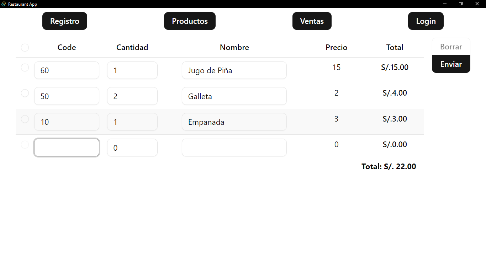
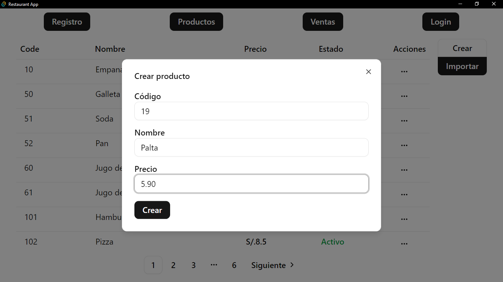
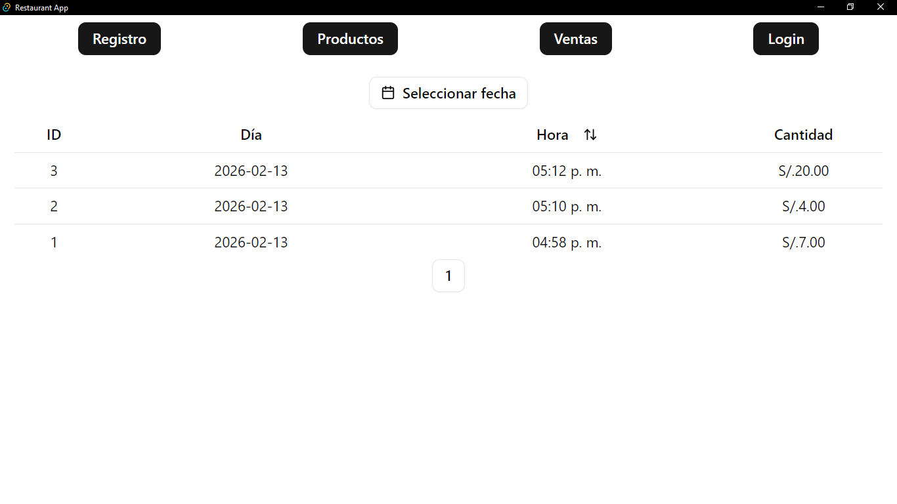

# Restaurant App

**This is a restaurant app that allows you to manage your restaurant's sales and inventory.**






## Setup

```sh
bun create vite restaurant-pos
cd ./restaurant-pos

bun add -D esbuild standard -E
bun add -D tailwindcss @tailwindcss/vite -E
bun add -D shadcn-ui -E

bun add @tanstack/react-form -E
bun add react-hook-form zod -E
bun add react-router-dom -E
bun add @tauri-apps/plugin-sql -E
❯ bun add papaparse @types/papaparse -E
```

**./package.json**

```json
{
  "eslintConfig": {
		"extends": "standard"
	}
}
```

**./vite.config.ts**

```ts
import react from "@vitejs/plugin-react";
import path from "path";
import tailwindcss from "@tailwindcss/vite";
import { defineConfig } from "vite";

export default defineConfig({
	plugins: [react(), tailwindcss()],
	resolve: {
		alias: {
			"@": path.resolve(__dirname, "./src"),
		},
	},
	server: {
		host: true,
		port: 5173,
	},
	base: "/",
});
```

**./src/tsconfig.app.json**

```json
{
  "compilerOptions": {
    // ...
    "baseUrl": ".",
    "paths": {
      "@/*": [
        "./src/*"
      ]
    }
    // ...
  }
}
```

**./src/index.css**
```css
@import "tailwindcss";
```

**shell**
```sh
bun add -D @types/node

bunx shadcn init
bunx --bun shadcn@latest add form input button checkbox
bunx --bun shadcn@latest add table pagination
bunx --bun shadcn@latest add dialog button-group
bunx --bun shadcn@latest add popover dropdown-menu
bunx --bun shadcn@latest add combobox calendar
```

## As a App

```sh
bun add -D @tauri-apps/cli@latest
bun add @tauri-apps/api

bun tauri init
```
### Tauri Dependencies

```sh
# bun tauri add store

cd ./src-tauri/

cargo add tauri-plugin-sql --features sqlite
```

## Start

```sh
bun tauri dev
```

## Por hacer

2. login avatar and options
1. Filter Sales Hour
3. credits
4. Graphics
5. visual table scroll

<!-- bun tauri add store -->